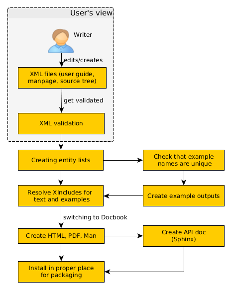

=============================
SCons Documentation Toolchain
=============================

Introduction
============

This text tries to give an overview of the current SCons documentation
toolchain.  As a prospective doc editor, you should be able to quickly
understand the basic concepts (if not, please let the project know how
it falls short).  It is also a reference for core developers and the
release team.

The diagram above roughly shows the steps that we currently need for
creating all the MAN pages, User manuals and reference documents. You
may think: "Geeez, that looks so complicated. Why can't they simply
convert XML files to PDF with Docbook, or use reST?" Please be patient,
and continue reading. Things will get a little clearer soon.

Our toolchain doesn't only produce HTML and PDF files that are nice
to look at, it also performs a lot of processing under the covers. We
try to have our documentation as consistent as possible to the current
behaviour of the source code, but this requires some extra steps.

So let's start right at the top...

Writer's view
=============

SCons documentation is written in Docbook (the xml variant).
The toolchain is set up so that a writer has a restricted view of the
whole "document processing thingy". All you should need to be concerned
with is to edit existing text or write new sections and paragraphs.
Sometimes even a completely new chapter has to be added. The hope
is that you can fire up your XML editor of choice and type away.

XML is easy to get wrong, so you need to case about
validating the XML files
against our special "SCons Docbook DTD/XSD". You can run the
special script

::

    python bin/docs-validate.py

from the top source folder to validate. If you are able to use
an XML editor, many of the potential problems are avoided -
the most common error is not matching tag opening and closing
(for example ``<tag>foo<tag>`` is an easy typing error to make,
as is starting a ``<para>``, typing text, and not adding the
closing ``</para>``). XML editors make it much harder to make
those errors, which minor though they seem, will completely
break the document build.

Everything's looking okay, all validation passed? Good, then simply
commits your new work, and create a pull request on Github. That's it!

Additionally, you can create the single documents locally if you want
to get a feel for how the final result looks (and who doesn't?). Each of
the document folders (``design``, ``developer``, ``man``, ``python10``,
``reference``, and ``user``) contains an ``SConstruct`` file along with
the actual XML files. You can call

::

    python ../../scripts/scons.py

from within the directory, and have the MAN pages or HTML created...even
PDF, if you have a renderer installed (``fop``, ``xep`` or ``jw``).

Validation
==========

Just a few more words about the validation step.  We are using our
own DTD/XSD as a kind of hook, which only exists to link our own SCons
documentation tags into the normal Docbook XSD. For the output, we always
have an intermediary step (see diagram above), where we rewrite tags like
``cvar`` into a block of Docbook formatting elements representing it.

The toolchain, and all the Python scripts supporting it, are based
on the prerequisite that all documents are valid against the SCons
Docbook XSD. This step guarantees that we can accept the pull request
of a user/writer with all his changes, and can create the documentation
for a new release of SCons without any problems at a later time.

Entities
========

We are using entities for special keywords like ``SCons`` that should
appear with the same formatting throughout the text. These are kept in
a single file ``doc/scons.mod`` which gets included by the documents.

Additionally, for each Tool, Builder, Cvar (construction variable) and
Function, a bunch of linkends in the form of entities get defined. They
can be used in the MAN page and the User manual.

When you add an XML file in the ``SCons/Tools`` folder, e.g. for
a tool named ``foobar``, you can use the two entities

*t-foobar*
    which prints the name of the Tool, and

*t-link-foobar*
    which is a link to the description of the Tool

The link will be to the appropriate Appendix in the User Guide,
or to the proper section in the manpage.

In the case of Functions, there may be pairs of these, depending
on the value of the signature attribute: this attribute tells
whether only the global function form, or only the environment
method form, or both, exist. If all four exist you will get:

*f-foobar*
    which prints the name of the global Function

*f-env-foobar*
    which prints the name of the environment method

*f-link-foobar*
    which is a link to the description of the global Function

*f-env-link-foobar*
    which is a link to the description of the environment method

By calling the script

::

    python bin/docs-update-generated.py
    
you can recreate the lists of entities (``*.mod``) in the ``generated``
folder, if required.  At the same time, this will generate the ``*.gen``
files, which list the full description of all the Builders, Tools,
Functions and CVars for the MAN page and the User Guide's appendix. 
Thus, you want to regenerate when there's a change to 
any of those four special elements, or an added or deleted element.
These generated files are left checked in so in the normal case you
can just rebuild the docs without having to first generate the entity
files.

For more information about how to properly describe these elements,
refer to the start of the Python script ``bin/SConsDoc.py``. It explains
the available tags and the exact syntax in detail.

Examples
========

In the User Guide, we support automatically created examples. This
means that the output of the specified source files and SConstructs
is generated by running them with the current SCons version.  We do this
to ensure that the output displayed in the manual is identical to what
you get when you run the example on the command-line.

A short description about how these examples have to be defined can be
found at the start of the file ``bin/SConsExamples.py``. Call

::

    python bin/docs-create-example-outputs.py

from the top level source folder, to run all examples through SCons.

Before this script starts to generate any output, it checks whether the
names of all defined examples are unique. Another important prerequisite
is that for every example all the single ``scons_output`` blocks need
to have a ``suffix`` attribute defined. These suffixes also have to be
unique, within each example.

All example output files (``*.xml``) get written to the folder
``doc/generated/examples``, together with all files defined via the
``scons_example_file`` tag. They are put under version control, in
part so that the version control system can show any unexpected
changes in the outputs after editing the docs:

::
   git diff doc/generated/examples

Note that these output files are not actually needed for editing the
documents. When loading the User manual into an XML editor, you will
always see the example's definition. Only when you create some output,
the files from ``doc/generated/examples`` get XIncluded and all special
``scons*`` tags are transformed into Docbook elements.

Directories
===========

Documents are in the folders ``design``, ``developer``, ``man``,
``python10``, ``reference``, and ``user``. Note that of these,
only ``man`` and ``user`` are actively maintained and some of
the others are vastly out of date.  If submitting a github
Pull Request for a new SCons feature, you will only be required
to update the documentation that goes into the manpage and the
User Guide.

*editor_configs*
    Prepared configuration sets for the validating WYSIWYG XML editors
    XmlMind and Serna. You'll probably want to try the latter, because
    the XXE config requires you to have a full version (costing a few
    hundred bucks) and is therefore untested. For installing the Serna
    config, simply copy the ``scons`` folder into the ``plugins``
    directory of your installation. Likewise, the XXE files from the
    ``xmlmind`` folder have to be copied into ``~/.xxe4/`` under Linux.

*generated*
    Entity lists and outputs of the UserGuide examples. They get generated
    by the update scripts ``bin/docs-update-generated.py`` 
    and ``bin/docs-create-example-outputs.py``.

*images*
    Images for the ``overview.rst`` document.
  
*xsd*
    The SCons Docbook schema (XSD), based on the Docbook v4.5 DTD/XSD.
  
*xslt*
    XSLT transformation scripts for converting the special SCons
    tags like ``scons_output`` to valid Docbook during document
    processing.
  
